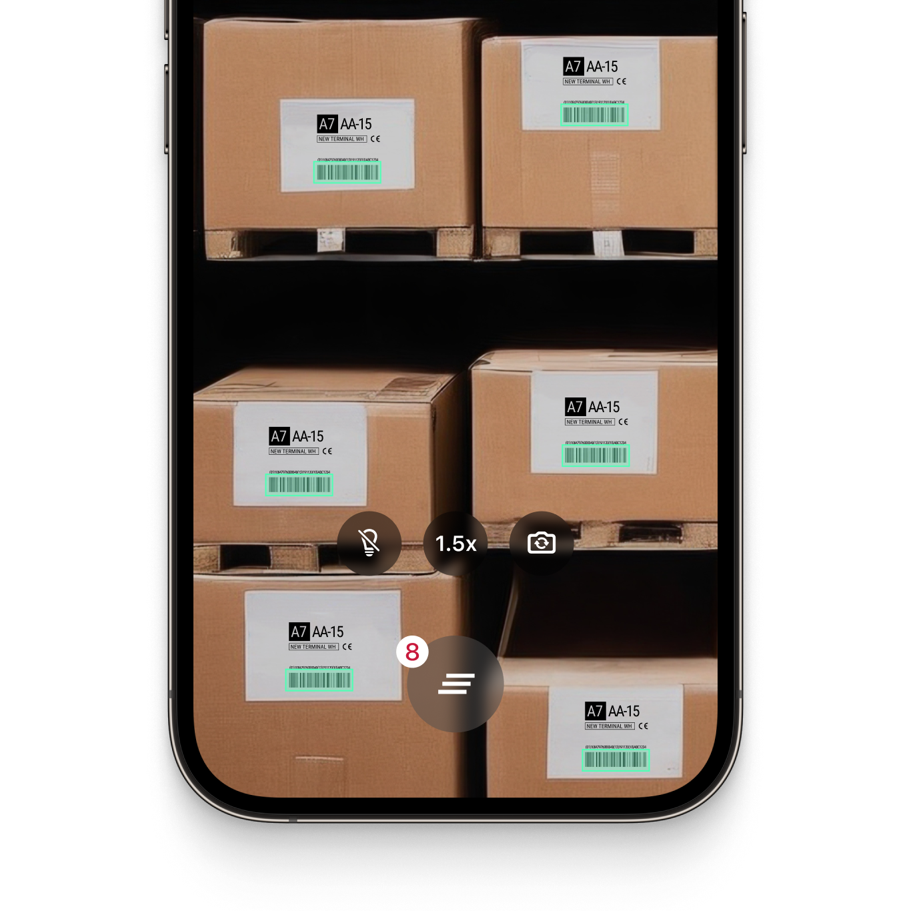

<p align="left">
  
</p>
<p align="left">
  
</p>

# Example App for the Scanbot .NET MAUI Barcode Scanner SDK

This example app demonstrates how to integrate the Scanbot Barcode Scanner SDK into your NET. MAUI application, for both Android and iOS. 

## What is the Scanbot Barcode Scanner SDK?

The Scanbot [Barcode Scanner SDK](https://scanbot.io/barcode-scanner-sdk/?utm_source=github.com&utm_medium=referral&utm_campaign=dev_sites) is a simple and intuitive barcode scanning library that turns mobile devices into fast and reliable barcode readers.

The SDK utilizes your device's camera, which can be freely switched. You can also apply various filters to narrow down the results by barcode type or content, with regex pattern support to ensure you only capture the specific barcodes relevant to your application.

It operates entirely offline on the user's device and takes only 0.04 seconds to scan barcodes. Scans are accurate even under challenging conditions, including damaged, small, or distant barcodes and low-light environments.

The plugin can be integrated into your app within minutes and comes with Ready-To-Use UI components, which allow you to customize the barcode scanner to your needs.

💡 For more details about the Scanbot .NET MAUI Barcode Scanner SDK, please check out our [documentation](https://docs.scanbot.io/barcode-scanner-sdk/maui/introduction/?utm_source=github.com&utm_medium=referral&utm_campaign=dev_sites).

## Requirements

Developing native, cross-platform .NET Multi-platform App UI apps requires the items mentioned below, according to the system you are building on.

### MacOS

* Download and install the [.NET SDK](https://dotnet.microsoft.com/en-us/download).
* Install the latest .NET MAUI workloads via terminal using this command `sudo dotnet workload install maui`.
* Install the Android and iOS SDKs.
* **Note:** As the IDE Visual Studio for Mac is no longer supported, you may want to check this article on [Visual Studio alternatives for Mac](https://scanbot.io/techblog/visual-studio-alternatives-for-mac/?utm_source=github.com&utm_medium=referral&utm_campaign=dev_sites).

### Windows

* Install [Visual Studio](https://dotnet.microsoft.com/en-us/download).
* To run and debug iOS applications, check [Pair to Mac](https://learn.microsoft.com/en-us/dotnet/maui/ios/pair-to-mac?view=net-maui-8.0) for iOS development.

## How to run the example app

Assuming you already have your development machine setup, the following commands will help you build and debug our projects:

### .NET

#### iOS

To build the iOS example project for both net8.0-ios and net9.0-ios, forcing packages to be restored and everything to be compiled from scratch:

```
dotnet build BarcodeSDK.NET.iOS.Example --force --no-incremental
```

To run the project on a real device, specify a target framework with `-f net9.0-ios` and the Run target via `-t:Run`, yielding the following:

```dotnet build BarcodeSDK.NET.iOS.Example -f net9.0-ios -t:Run --force --no-incremental```

##### Android
To build the Android example project for both net8.0-android and net9.0-android, forcing packages to be restored and everything to be compiled from scratch:

```
dotnet build BarcodeSDK.NET.Droid.Example --force --no-incremental
```

To run the project on a real device, specify a target framework with `-f net9.0-android` and the Run target via `-t:Run`, yielding the following:

```dotnet build BarcodeSDK.NET.Droid.Example -f net9.0-android -t:Run --force --no-incremental```

### MAUI

To build the MAUI example project for all supported target frameworks (net8.0-android, net8.0-ios, net9.0-android and net9.0-ios) and forcing packages to be restored and everything to be compiled from scratch, execute:

```
dotnet build BarcodeSDK.MAUI.Example --force --no-incremental
```

To run the project on a real iOS device, specify a target framework with `-f net9.0-ios` and the Run target via `-t:Run`, yielding the following:

```dotnet build BarcodeSDK.MAUI.Example -f net9.0-ios -t:Run --force --no-incremental```

To run the project on a real Android device, specify a target framework with `-f net9.0-android` and the Run target via `-t:Run`, yielding the following:

```dotnet build BarcodeSDK.MAUI.Example -f net9.0-android -t:Run --force --no-incremental```

## Features of the .NET MAUI Barcode Scanner SDK

### Out-of-the-box barcode scanning workflows

The Scanbot Barcode Scanner SDK offers the following scan modes right out of the box in our ready-to-use UI. These modes not only allow you to customize the visuals to match your needs but also include user guidance features, localization options for UI elements, or the ability to control camera zoom settings for optimal scanning performance.

#### Single Scanning

This is the default barcode scanning mode. It is optimized for detecting single barcodes and is easily configurable to your needs. You can show a confirmation screen after scanning the barcode.

#### Batch & Multi Scanning

The barcode scanner can also be configured to scan multiple barcodes in succession (without closing the scanning screen every time), to capture multiple barcodes present from the camera view at once, or to count the scanned items.

#### Find & Pick 

Given one or more barcodes, the SDK will visually highlight and scan the correct items for your users. It automatically selects the barcode with the right barcode value from your camera feed.

|  |  |  |
| :-- | :-- | :-- |

### AR Overlay

The Scanbot .NET Maui Barcode Scanner SDK includes an optional AR Overlay for all scanning modes. It provides real-time barcode highlighting, preview, and tap-to-select functionalities.

Recognized barcodes are highlighted with a customizable frame and text, clearly distinguishing scanned from unscanned items. The overlay dynamically adjusts the transformed barcode bounding box to align with the camera's perspective, ensuring accurate visualization.

### Scanning barcodes from an image

The Scanbot SDK also offers barcode scanning for still images, enabling barcode detection from JPG and other image files. It supports single-image and multi-image detection and returns a list with the recognized barcodes.

### Supported barcodes

The Scanbot .NET MAUI barcode scanner supports all common 1D- or 2D barcode types, such as QR codes or Data Matrix codes, as well as multiple postal symbologies, including:

| Barcode type       | Barcode symbologies                                                                                                                                                                                                                                                                                                                                                                                                                                                                                                                                                                                                                                                                                                                                                                                                                                                                                                                                                                                                                                                                                                                                                                                                                                            |
|:-------------------|:---------------------------------------------------------------------------------------------------------------------------------------------------------------------------------------------------------------------------------------------------------------------------------------------------------------------------------------------------------------------------------------------------------------------------------------------------------------------------------------------------------------------------------------------------------------------------------------------------------------------------------------------------------------------------------------------------------------------------------------------------------------------------------------------------------------------------------------------------------------------------------------------------------------------------------------------------------------------------------------------------------------------------------------------------------------------------------------------------------------------------------------------------------------------------------------------------------------------------------------------------------------|
| 1D Barcodes        | [EAN](https://scanbot.io/barcode-scanner-sdk/ean/?utm_source=github.com&utm_medium=referral&utm_campaign=dev_sites), [UPC](https://scanbot.io/barcode-scanner-sdk/upc/?utm_source=github.com&utm_medium=referral&utm_campaign=dev_sites), [Code 128](https://scanbot.io/barcode-scanner-sdk/code-128/?utm_source=github.com&utm_medium=referral&utm_campaign=dev_sites), [GS1-128](https://scanbot.io/barcode-scanner-sdk/gs1-128/?utm_source=github.com&utm_medium=referral&utm_campaign=dev_sites), [Code 39](https://scanbot.io/barcode-scanner-sdk/code-39/?utm_source=github.com&utm_medium=referral&utm_campaign=dev_sites), [Codabar](https://scanbot.io/barcode-scanner-sdk/codabar/?utm_source=github.com&utm_medium=referral&utm_campaign=dev_sites), [ITF](https://scanbot.io/barcode-scanner-sdk/itf-code/?utm_source=github.com&utm_medium=referral&utm_campaign=dev_sites), Code 25, Code 32, Code 93, Code 11, MSI Plessey, Standard 2 of 5, IATA 2 of 5, Databar (RSS), GS1 Composite                                                                                                                                                                                                                                                                                                                        |
| 2D Barcodes        | [QR Code](https://scanbot.io/glossary/qr-code/?utm_source=github.com&utm_medium=referral&utm_campaign=dev_sites), [Micro QR Code](https://scanbot.io/barcode-scanner-sdk/micro-qr-code/?utm_source=github.com&utm_medium=referral&utm_campaign=dev_sites), [Aztec Code](https://scanbot.io/barcode-scanner-sdk/aztec-code/?utm_source=github.com&utm_medium=referral&utm_campaign=dev_sites), [PDF417 Code](https://scanbot.io/barcode-scanner-sdk/pdf417/?utm_source=github.com&utm_medium=referral&utm_campaign=dev_sites), [Data Matrix Code,](https://scanbot.io/barcode-scanner-sdk/data-matrix/?utm_source=github.com&utm_medium=referral&utm_campaign=dev_sites) [GiroCode](https://scanbot.io/glossary/giro-code/?utm_source=github.com&utm_medium=referral&utm_campaign=dev_sites), [NTIN Code](https://scanbot.io/glossary/gtin/?utm_source=github.com&utm_medium=referral&utm_campaign=dev_sites), [PPN](https://scanbot.io/glossary/ppn/?utm_source=github.com&utm_medium=referral&utm_campaign=dev_sites), [UDI](https://scanbot.io/glossary/udi/?utm_source=github.com&utm_medium=referral&utm_campaign=dev_sites), [Royal Mail Mailmark](https://scanbot.io/barcode-scanner-sdk/royal-mail/?utm_source=github.com&utm_medium=referral&utm_campaign=dev_sites), MaxiCode |
| Postal Symbologies | USPS Intelligent Mail (IMb), Royal Mail RM4SCC Barcode, Australia Post 4-State Customer Code, Japan Post 4-State Customer Code, KIX                                                                                                                                                                                                                                                                                                                                                                                                                                                                                                                                                                                                                                                                                                                                                                                                                                                                                                                                                                                                                                                                                                                            |

💡 Please visit our [docs](https://docs.scanbot.io/barcode-scanner-sdk/maui/supported-barcodes/?utm_source=github.com&utm_medium=referral&utm_campaign=dev_sites) for a complete overview of the supported barcode symbologies.

### Data Parsers

The Scanbot Barcode Scanner SDK supports a variety of data parsers that extract structured information from 2D barcodes such as QR Codes and Data Matrix. These include parsers for documents such as driving licences (AAMVA), boarding passes, medical certificates, SEPA forms, Swiss QR codes and vCard business cards.

💡 Please refer to our [documentation](https://docs.scanbot.io/barcode-scanner-sdk/maui/supported-barcodes/#data-parsers) for a full list of supported data parsers.

## Additional information

### Guides and Tutorials

Integrating the Scanbot .NET MAUI Barcode Scanner plugin into your .NET MAUI app takes just a few minutes, and our step-by-step guides make the process even easier. 

💡 Our [.NET MAUI Barcode Scanner tutorial](https://scanbot.io/techblog/net-maui-barcode-scanner-sdk-integration-tutorial/?utm_source=github.com&utm_medium=referral&utm_campaign=dev_sites) walks you through the process step by step.

Alternatively, check out our [developer blog](https://scanbot.io/techblog/?utm_source=github.com&utm_medium=referral&utm_campaign=dev_sites) for a collection of in-depth tutorials, use cases, and best practices.

### Free integration support

Need help integrating our Barcode Scanner SDK into your .NET MAUI project? We offer [free developer support](https://docs.scanbot.io/support/?utm_source=github.com&utm_medium=referral&utm_campaign=dev_sites) via Slack, MS Teams, or email.

As a customer, you also get access to a dedicated support Slack or Microsoft Teams channel to talk directly to your dedicated Customer Success Manager and our engineers.

### Licensing and pricing

The barcode scanner example app will run one minute per session without a license. After that, all functionalities and UI components will stop working.

To try the barcode scanner without the one-minute limit, you can request a free, no-strings-attached [7-day trial license](https://scanbot.io/trial/?utm_source=github.com&utm_medium=referral&utm_campaign=dev_sites).

Our pricing model is simple: Unlimited barcode scanning for a flat annual license fee, full support included. There are no tiers, usage charges, or extra fees. [Contact](https://scanbot.io/contact-sales/?utm_source=github.com&utm_medium=referral&utm_campaign=dev_sites) our team to receive your quote.

### Other supported platforms

Besides .NET MAUI, the Scanbot Barcode Scanner SDK is also available on:

* [Android (native)](https://github.com/doo/scanbot-barcode-scanner-sdk-example-android)
* [iOS (native)](https://github.com/doo/scanbot-barcode-scanner-sdk-example-ios)
* [JavaScript (web)](https://github.com/doo/scanbot-barcode-scanner-sdk-example-web)
* [React Native](https://github.com/doo/scanbot-barcode-scanner-sdk-example-react-native)
* [Flutter](https://github.com/doo/scanbot-barcode-scanner-sdk-example-flutter)
* [Capacitor & Ionic](https://github.com/doo/scanbot-barcode-scanner-sdk-example-capacitor-ionic)
* [Cordova & Ionic](https://github.com/doo/scanbot-barcode-scanner-sdk-example-cordova-ionic)
* [Compose Multiplatform / KMP](https://github.com/doo/scanbot-barcode-scanner-sdk-example-kmp)
* [Xamarin & Xamarin.Forms](https://github.com/doo/scanbot-barcode-scanner-sdk-example-xamarin)
* [UWP](https://github.com/doo/scanbot-barcode-scanner-sdk-example-windows)
* [Linux](https://github.com/doo/scanbot-sdk-example-linux)